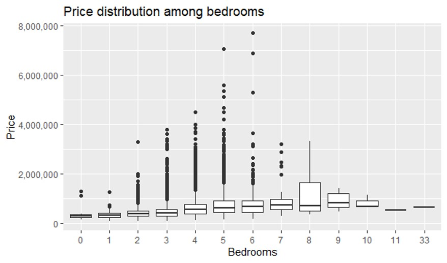
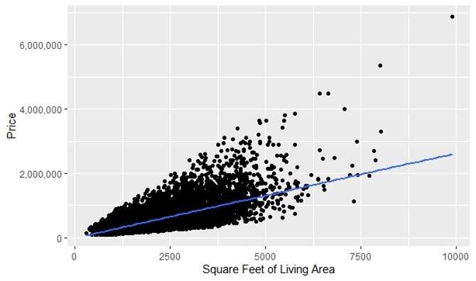

# House Price Prediction in King County, USA

Welcome to the House Price Prediction project repository! This project is part of the ISDS 540 course, focusing on using machine learning techniques to predict house prices in King County, Washington, USA.

## Table of Contents

- [Project Overview](#project-overview)
- [Dataset](#dataset)
- [Data Preprocessing](#data-preprocessing)
- [Modeling](#modeling)
- [Evaluation](#evaluation)
- [Results](#results)
- [Limitations and Future Work](#limitations-and-future-work)
- [Setup](#setup)
- [Screenshots of Visualizations/Results](#screenshots-of-visualizationsresults)


## Project Overview

This project aims to predict the selling price of houses in King County, Washington, USA, using various machine learning models. The dataset includes information on houses sold between May 2014 and May 2015. Predicting house prices accurately is crucial for buyers, sellers, and real estate professionals. By leveraging machine learning techniques, we can analyze patterns in the housing data and develop models that provide reliable price predictions.

The project involves several steps:

1. **Exploratory Data Analysis (EDA):** We analyze and visualize the dataset to understand the distribution and relationships between variables.
2. **Data Preprocessing:** This includes handling missing values, outlier detection and removal, and encoding categorical variables.
3. **Modeling:** We implement various regression models to predict house prices.
4. **Evaluation:** Models are evaluated based on metrics such as RMSE (Root Mean Square Error) and R-squared.
5. **Results Interpretation:** We interpret the results and derive insights that can help in understanding the key factors influencing house prices.

The project demonstrates the application of machine learning in real estate and highlights the importance of data preprocessing and model evaluation in developing accurate predictive models.

## Dataset

The dataset consists of 21,613 observations and 21 variables, including:

- **id:** Unique ID for each home sold
- **date:** Date of the home sale
- **price:** Price of each home sold
- **bedrooms:** Number of bedrooms
- **bathrooms:** Number of bathrooms
- **sqft_living:** Square footage of the interior living space
- **sqft_lot:** Square footage of the land space
- **floors:** Number of floors
- **waterfront:** Dummy variable for waterfront view
- **view:** Index from 0 to 4 of property view quality
- **condition:** Index from 1 to 5 of the property condition
- **grade:** Index from 1 to 13 of the construction and design quality
- **sqft_above:** Square footage above ground level
- **sqft_basement:** Square footage below ground level
- **yr_built:** Year the house was built
- **yr_renovated:** Year of the last renovation
- **zipcode:** ZIP code area
- **lat:** Latitude
- **long:** Longitude
- **sqft_living15:** Square footage of living space for the nearest 15 neighbors
- **sqft_lot15:** Square footage of land lots for the nearest 15 neighbors

## Data Preprocessing

Data preprocessing steps include:

- **Handling Missing Values:** Imputing or removing missing values.
- **Outlier Detection and Removal:** Identifying and removing outliers.
- **Categorical Variable Encoding:** Converting categorical variables into numerical format.
- **Normalization and Scaling:** Standardizing data to improve model performance.

## Modeling

Several machine learning models and techniques were implemented:

1. **Simple Linear Regression:** Predicting house prices based on a single feature.
2. **Multiple Linear Regression:** Using multiple features to predict house prices.
3. **Advanced Regression Models:** Implementing more complex models including interactions and polynomial terms.

## Evaluation

Models were evaluated based on:

- **RMSE (Root Mean Square Error):** Measure of the differences between predicted and actual values.
- **R-squared:** Proportion of the variance in the dependent variable that is predictable from the independent variables.

## Results

### Simple Linear Regression
- **Feature:** Square footage of living space
- **Performance:** Basic model with a single predictor.

### Multiple Linear Regression
- **Features:** Bedrooms, bathrooms, sqft_living, sqft_lot, floors
- **Performance:** Improved model accuracy with multiple predictors.

### Advanced Regression Models
- **Features:** Almost all features in the dataset
- **Performance:** Best model performance with the lowest RMSE and highest R-squared.

## Limitations and Future Work

### Limitations
- **Data Dependency:** Model performance varies with dataset characteristics.
- **Feature Engineering:** Limited by initial feature selection and engineering.
- **Sample Diversity:** Limited sample size and diversity affecting generalizability.

### Future Work
- **Additional Data Sources:** Incorporating more diverse populations.
- **Advanced Techniques:** Exploring sophisticated machine learning and deep learning approaches.
- **Longitudinal Analysis:** Using longitudinal data to assess long-term model accuracy.

## Setup

To set up the project locally, follow these steps:

1. **Ensure R is Installed:**
   - Download and install R from the official [CRAN](https://cran.r-project.org/) website.

2. **Install Required R Packages:**
   - Open your R console or RStudio and run the following command to install the necessary packages:
     ```R
     install.packages(c("tidyverse", "ggplot2", "outliers", "readr", "broom", "corrplot", "jtools"))
     ```

3. **Clone this repository to your local machine using Git:**
   ```sh
   git clone https://github.com/VamsiTanneru/HousePricePrediction.git

4. **Run the Code**:
   - Open the R Script:
     Open '540 final code (1).R' in your R environment (e.g., RStudio).
   - Execute the Script:
     Run the script to perform the data analysis and modeling.


## Screenshots of Visualizations/Results






